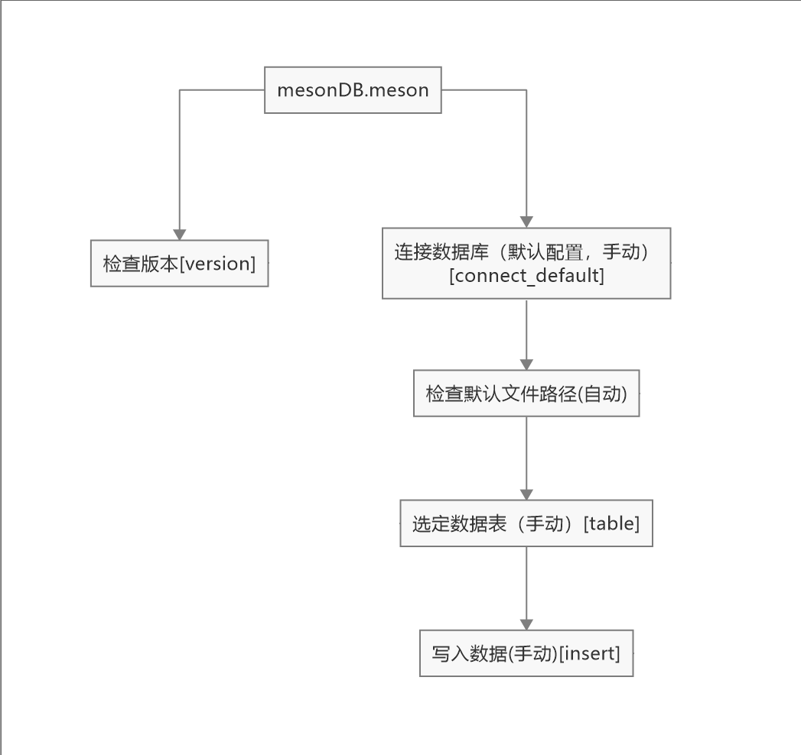

meson是一个为python程序服务的本地化非关系数据库系统模块，同时也是一个中转站，将高频储存随时调用的数据储存在本地，将关键需第三方调用的数据自动处理格式储存在远程mysql

## 项目名字来源及含义

“meson“英文直接翻译过来是微观物理名词“介子”，是粘合质子和中子的微粒子。“介子”在中文可以拆分成”介“和”子“两个字。”介“可以理解为”中介“，即代表发挥中间媒介的作用；”子“可以理解”附属“，即代表该系统是另外一个主系统的子系统来连接主系统的连接器，一切为主系统服务

##  联系开发者

[BiliBili@绝不一惊一乍的炜翼（原账号，发布精心剪辑视频）](https://space.bilibili.com/1392269532/)

[BiliBili@炜翼的临时直播间（直播专用账号，发布直播录像视频）](https://space.bilibili.com/1392269532/)

QQ号：2516427163

##  开源项目镜像

某些代码或说明无法查看时，可前往镜像

中国：[Gitee](https://gitee.com/leoweyr/mesonDB)

## 模块调用

```python
import mesonDB.meson
#“mesonDB”文件夹放在主程序根目录，“meson.py”放在该目录下
```

## 函数调用逻辑图

按工作逻辑调用函数，否则会出错!



## 函数调用层级关系


```python
mesonDB.meson.connect
mesonDB.meson.connect.table
#以上为调用例子
#层级表示函数包含关系,数字越小越顶级。“->”表示父级函数

connect_default(database)
#参数:database = 数据库
#层级：1

table(table)
#参数：table = 数据表
#层级：2 -> connect_default

insert(data)
#参数：data = 数据内容
#层级：2 -> connect_default
```

